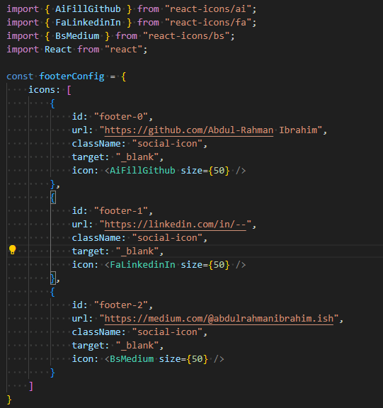
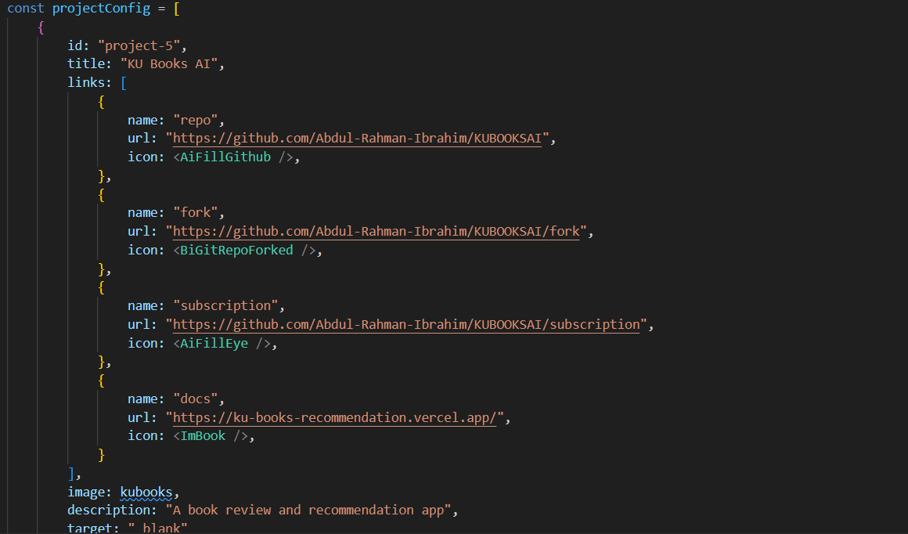

<h2>
  Personal Portfolio
  <a href="https://abdul-rahman-ibrahim.github.io/portfolio/" target="_blank">Website</a>
</h2>

This is my personal website.

## Installation Guide

* Fork the project
  ```
  https://github.com/rodrigo-arenas/portfolio/fork
  ```
* Clone your fork
  ```
  git clone https://github.com/{yourusername}/portfolio.git
  ```
* Install the packages
  ```
  npm install
  ```
* Start the project
  ```
  npm start
  ```

## Customize your information

All the content (text, icons, links, etc.) are configured in the `assets` folders,
it has two kinds:

### Configs:

There is one configuration file per page or main component, for example if you want
to modify the footer icons and hyperlinks, go to the footerConfig.js file



Here, you can modify all the values but keep the key's names, structure and className the same;
you can also add new values to the configs containing a list.


### Images:

This folder is meant to keep images that are displayed over some routes, like the blogs and projects.
For example, inside the projectsConfig.js file, the list of projects has a property called "image":



You can set any valid href for the `<a/>` tag as an image URL or, like in the above image,
an image from the `assets/images` folder.


### Set Google Analytics track (Optional):

Take the `.env.example` file, put your tracking id in the
variable `REACT_APP_TRACKING_ID` and rename the file to `.env`

### reference


